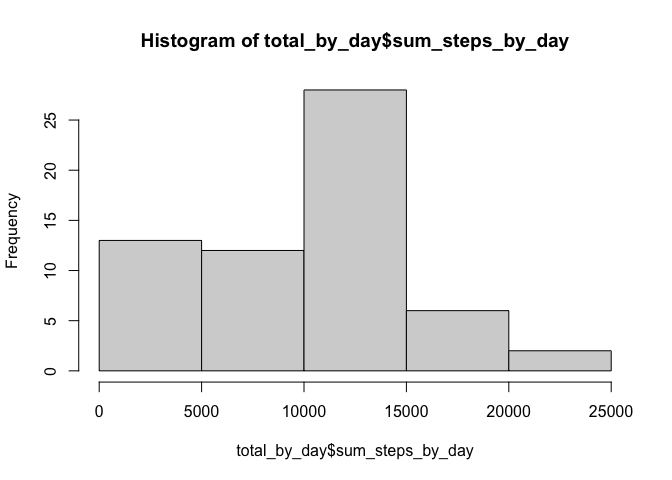
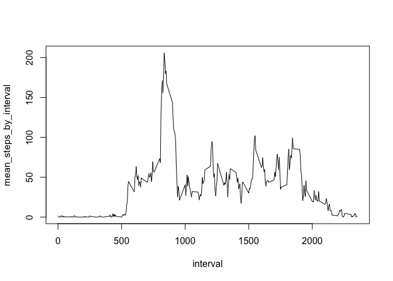
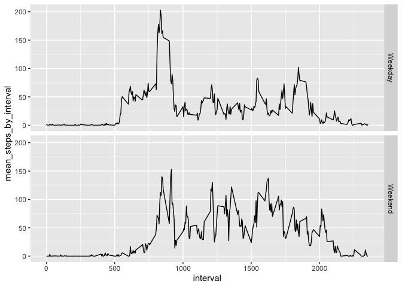

## Loading and preprocessing the data

```r
unzip('activity.zip')
```

reading file

```r
data <- read.csv('activity.csv')
head(data)
```

```
##   steps       date interval
## 1    NA 2012-10-01        0
## 2    NA 2012-10-01        5
## 3    NA 2012-10-01       10
## 4    NA 2012-10-01       15
## 5    NA 2012-10-01       20
## 6    NA 2012-10-01       25
```
processing dates

```r
library(lubridate)
```

```
## Loading required package: timechange
```

```
## 
## Attaching package: 'lubridate'
```

```
## The following objects are masked from 'package:base':
## 
##     date, intersect, setdiff, union
```

```r
data$date <- ymd(data$date)
head(data)
```

```
##   steps       date interval
## 1    NA 2012-10-01        0
## 2    NA 2012-10-01        5
## 3    NA 2012-10-01       10
## 4    NA 2012-10-01       15
## 5    NA 2012-10-01       20
## 6    NA 2012-10-01       25
```

## What is mean total number of steps taken per day?

Total steps by day

```r
library(tidyverse)
```

```
## ── Attaching packages ─────────────────────────────────────── tidyverse 1.3.2 ──
## ✔ ggplot2 3.4.0      ✔ purrr   0.3.5 
## ✔ tibble  3.1.8      ✔ dplyr   1.0.10
## ✔ tidyr   1.2.1      ✔ stringr 1.4.1 
## ✔ readr   2.1.3      ✔ forcats 0.5.2 
## ── Conflicts ────────────────────────────────────────── tidyverse_conflicts() ──
## ✖ lubridate::as.difftime() masks base::as.difftime()
## ✖ lubridate::date()        masks base::date()
## ✖ dplyr::filter()          masks stats::filter()
## ✖ lubridate::intersect()   masks base::intersect()
## ✖ dplyr::lag()             masks stats::lag()
## ✖ lubridate::setdiff()     masks base::setdiff()
## ✖ lubridate::union()       masks base::union()
```

```r
total_by_day <- data %>%
  group_by(date) %>%
  summarize(sum_steps_by_day = sum(steps, na.rm=T))
total_by_day
```

```
## # A tibble: 61 × 2
##    date       sum_steps_by_day
##    <date>                <int>
##  1 2012-10-01                0
##  2 2012-10-02              126
##  3 2012-10-03            11352
##  4 2012-10-04            12116
##  5 2012-10-05            13294
##  6 2012-10-06            15420
##  7 2012-10-07            11015
##  8 2012-10-08                0
##  9 2012-10-09            12811
## 10 2012-10-10             9900
## # … with 51 more rows
```
Histogram of steps by day

```r
total_by_day <- data %>%
  group_by(date) %>%
  summarize(sum_steps_by_day = sum(steps, na.rm=T))
total_by_day
```

```
## # A tibble: 61 × 2
##    date       sum_steps_by_day
##    <date>                <int>
##  1 2012-10-01                0
##  2 2012-10-02              126
##  3 2012-10-03            11352
##  4 2012-10-04            12116
##  5 2012-10-05            13294
##  6 2012-10-06            15420
##  7 2012-10-07            11015
##  8 2012-10-08                0
##  9 2012-10-09            12811
## 10 2012-10-10             9900
## # … with 51 more rows
```

```r
hist(total_by_day$sum_steps_by_day)
```

<!-- -->

Summary of data including means and medians

```r
summary(data)
```

```
##      steps             date               interval     
##  Min.   :  0.00   Min.   :2012-10-01   Min.   :   0.0  
##  1st Qu.:  0.00   1st Qu.:2012-10-16   1st Qu.: 588.8  
##  Median :  0.00   Median :2012-10-31   Median :1177.5  
##  Mean   : 37.38   Mean   :2012-10-31   Mean   :1177.5  
##  3rd Qu.: 12.00   3rd Qu.:2012-11-15   3rd Qu.:1766.2  
##  Max.   :806.00   Max.   :2012-11-30   Max.   :2355.0  
##  NA's   :2304
```
Mean and median of steps by day ignoring NA values

```r
library(tidyverse)
table(data$steps)
```

```
## 
##     0     1     2     3     4     5     6     7     8     9    10    11    12 
## 11014     7     8     3    25    17    33    87    83    61    46    43    43 
##    13    14    15    16    17    18    19    20    21    22    23    24    25 
##    42    30    68    65    61    50    51    53    38    46    40    42    40 
##    26    27    28    29    30    31    32    33    34    35    36    37    38 
##    34    45    42    36    37    41    44    48    35    46    37    33    45 
##    39    40    41    42    43    44    45    46    47    48    49    50    51 
##    44    39    24    31    37    31    22    38    24    24    30    29    27 
##    52    53    54    55    56    57    58    59    60    61    62    63    64 
##    32    23    18    33    25    28    28    24    30    21    31    24    27 
##    65    66    67    68    69    70    71    72    73    74    75    76    77 
##    22    22    17    24    18    20    26    16    13    25    18    18    15 
##    78    79    80    81    82    83    84    85    86    87    88    89    90 
##    18    18    19    13    17    10    10    14    14     6    14     9    12 
##    91    92    93    94    95    96    97    98    99   100   101   102   103 
##     7    14     6    12    13     7    10     8     9     8    12     7    10 
##   104   105   106   107   108   109   110   111   112   113   114   115   116 
##     8     9     9     8     7     8     7    11    10     6    10     6     5 
##   117   118   119   120   121   122   123   124   125   126   127   128   129 
##    10     4    13     8     6     7     7     8     1     3     6    10     7 
##   130   131   132   133   134   135   136   137   138   139   140   141   142 
##     3     6     2     3     2    10     6     9     7     7     2     3     6 
##   143   144   145   146   147   148   149   150   151   152   153   154   155 
##    10     5     3     9     1     7     6     2     2     6     8     8     2 
##   156   157   158   159   160   161   162   163   164   165   166   167   168 
##     6     4     5     6     4     5     1     5     3     2     4     4     8 
##   170   171   172   173   174   175   176   177   178   179   180   181   182 
##     8     6     7     6     7     3     6     1     4     6     4     3     3 
##   183   184   185   186   187   188   189   190   191   192   193   194   195 
##     3     3     3     4     2     4     3     7     1     2     5     3     1 
##   196   197   198   199   200   201   202   203   204   205   206   207   208 
##     1     5     4     3     2     3     2     6     3     3     1     3     2 
##   209   210   211   212   213   214   216   219   221   223   224   225   229 
##     1     1     3     1     1     1     2     2     2     4     1     2     1 
##   230   231   232   235   236   237   238   240   241   242   243   244   245 
##     2     2     3     1     1     2     2     1     2     2     3     1     3 
##   247   248   249   250   251   252   253   254   255   256   257   258   259 
##     3     1     1     2     1     2     1     1     1     1     3     1     1 
##   260   261   262   263   264   265   266   267   269   270   271   272   274 
##     7     1     2     2     3     1     4     2     2     1     1     3     2 
##   275   276   277   279   280   281   282   283   284   285   286   287   289 
##     3     2     4     3     2     5     2     2     2     3     5     1     1 
##   290   291   292   293   294   295   297   298   299   301   302   303   304 
##     2     2     2     2     2     1     1     5     1     2     1     1     1 
##   305   306   307   308   309   310   311   312   313   314   315   316   317 
##     1     3     1     2     1     4     3     2     1     2     1     2     2 
##   318   319   320   321   322   323   324   325   326   327   328   330   331 
##     1     4     1     3     2     2     2     2     2     1     2     2     1 
##   332   333   334   335   336   339   340   341   343   344   345   346   347 
##     3     1     4     3     1     1     2     1     2     1     3     1     1 
##   349   350   351   353   354   355   356   357   358   359   360   361   362 
##     4     1     4     1     1     1     2     1     3     1     1     2     2 
##   363   364   365   366   368   370   371   372   373   374   375   376   377 
##     1     4     1     3     1     1     3     1     1     2     1     1     4 
##   378   380   384   385   387   388   389   391   392   393   394   395   396 
##     1     2     1     1     2     1     3     2     2     5     1     3     2 
##   397   399   400   401   402   403   404   405   406   408   410   411   412 
##     2     2     4     2     2     3     3     1     2     2     1     4     2 
##   413   414   415   416   417   418   419   421   422   423   424   425   426 
##     5     2     3     3     1     3     1     1     1     1     1     3     1 
##   427   428   429   431   432   433   434   435   436   437   439   440   441 
##     1     1     2     1     4     3     1     2     1     2     4     4     2 
##   442   443   444   446   449   450   451   453   454   456   457   458   459 
##     1     4     4     4     1     2     3     3     2     1     2     1     1 
##   461   462   463   464   465   466   467   468   469   470   471   472   473 
##     1     2     4     1     4     2     1     5     2     1     1     2     4 
##   474   475   476   477   478   479   480   481   482   483   484   485   486 
##     1     4     4     1     1     2     1     1     3     4     1     4     2 
##   487   488   489   490   491   492   493   494   495   496   497   498   499 
##     2     3     6     1     2     1     2     3     4     3     2     2     4 
##   500   501   503   504   505   506   507   508   509   510   511   512   513 
##     3     3     2     6     3     3     4     4     3     2     6     3     4 
##   514   515   516   517   518   519   520   521   522   523   524   526   527 
##     1     4     2     3     2     6     2     1     5     4     2     5     4 
##   528   529   530   531   532   533   534   535   536   537   539   540   541 
##     3     5     2     1     3     8     3     1     2     1     1     5     2 
##   542   544   545   546   547   548   549   551   553   555   556   559   562 
##     2     2     1     4     1     1     2     1     1     2     1     1     1 
##   567   568   569   571   573   574   577   581   584   591   592   594   597 
##     1     2     1     1     1     1     1     1     1     1     1     1     1 
##   600   602   606   608   611   612   613   614   618   619   625   628   630 
##     1     1     1     1     1     1     3     1     1     2     1     1     1 
##   634   635   637   638   639   643   652   655   659   662   665   667   668 
##     1     1     1     1     1     1     3     1     2     1     1     1     1 
##   679   680   681   682   686   687   690   693   697   698   701   706   708 
##     1     2     1     1     1     1     1     1     1     1     1     2     1 
##   709   710   713   714   715   717   718   720   721   725   726   727   729 
##     1     1     2     1     2     1     1     1     4     1     2     1     1 
##   730   731   732   733   734   735   736   737   738   739   741   742   743 
##     1     3     2     4     1     2     1     2     1     2     1     3     3 
##   744   745   746   747   748   749   750   751   752   753   754   755   756 
##     2     1     2     4     4     2     3     1     1     2     2     3     2 
##   757   758   759   760   765   766   767   768   769   770   777   781   783 
##     4     5     2     2     1     1     1     1     1     3     1     1     1 
##   785   786   789   794   802   806 
##     3     1     1     1     1     1
```

```r
mean_by_day <- data %>%
  group_by(date) %>%
  summarize(mean_steps_by_day = mean(steps, na.rm=T), median_steps_by_day= median(steps, na.rm=T))
mean_by_day
```

```
## # A tibble: 61 × 3
##    date       mean_steps_by_day median_steps_by_day
##    <date>                 <dbl>               <dbl>
##  1 2012-10-01           NaN                      NA
##  2 2012-10-02             0.438                   0
##  3 2012-10-03            39.4                     0
##  4 2012-10-04            42.1                     0
##  5 2012-10-05            46.2                     0
##  6 2012-10-06            53.5                     0
##  7 2012-10-07            38.2                     0
##  8 2012-10-08           NaN                      NA
##  9 2012-10-09            44.5                     0
## 10 2012-10-10            34.4                     0
## # … with 51 more rows
```

## What is the average daily activity pattern?

Time series plot of mean by day

```r
steps_by_interval <- data %>%
  group_by(interval) %>%
  summarize(mean_steps_by_interval = mean(steps, na.rm=T), median_steps_by_interval = median(steps, na.rm=T))

with(steps_by_interval, plot(interval, mean_steps_by_interval, type='l'))
```

<!-- -->

5 minute interval that contains the max number of steps

```r
steps_by_interval[which.max(steps_by_interval$mean_steps_by_interval),]
```

```
## # A tibble: 1 × 3
##   interval mean_steps_by_interval median_steps_by_interval
##      <int>                  <dbl>                    <int>
## 1      835                   206.                       19
```

## Imputing missing values

Imputing missing with Median with Caret

```r
library(caret)
```

```
## Loading required package: lattice
```

```
## 
## Attaching package: 'caret'
```

```
## The following object is masked from 'package:purrr':
## 
##     lift
```

```r
data_imp_model = preProcess(data, "medianImpute")
idata = predict(data_imp_model, data)
summary(idata)
```

```
##      steps             date               interval     
##  Min.   :  0.00   Min.   :2012-10-01   Min.   :   0.0  
##  1st Qu.:  0.00   1st Qu.:2012-10-16   1st Qu.: 588.8  
##  Median :  0.00   Median :2012-10-31   Median :1177.5  
##  Mean   : 32.48   Mean   :2012-10-31   Mean   :1177.5  
##  3rd Qu.:  0.00   3rd Qu.:2012-11-15   3rd Qu.:1766.2  
##  Max.   :806.00   Max.   :2012-11-30   Max.   :2355.0
```

Histogram of steps by day

```r
total_by_day <- idata %>%
  group_by(date) %>%
  summarize(sum_steps_by_day = sum(steps, na.rm=T))
total_by_day
```

```
## # A tibble: 61 × 2
##    date       sum_steps_by_day
##    <date>                <dbl>
##  1 2012-10-01                0
##  2 2012-10-02              126
##  3 2012-10-03            11352
##  4 2012-10-04            12116
##  5 2012-10-05            13294
##  6 2012-10-06            15420
##  7 2012-10-07            11015
##  8 2012-10-08                0
##  9 2012-10-09            12811
## 10 2012-10-10             9900
## # … with 51 more rows
```

```r
hist(total_by_day$sum_steps_by_day)
```

<!-- -->
#Mean and median of the imputed data; mean is lower, median is the same

```r
summary(idata$steps)
```

```
##    Min. 1st Qu.  Median    Mean 3rd Qu.    Max. 
##    0.00    0.00    0.00   32.48    0.00  806.00
```

## Are there differences in activity patterns between weekdays and weekends?

```r
find_weekend <- function(day_of_week){
  if(day_of_week == "Saturday"||day_of_week == "Sunday"){
    paste('Weekend')
  }
  else{
    paste('Weekday')
  }
}
idata <- idata %>% mutate(day_of_week = weekdays(date), isWeekend = ifelse(day_of_week == "Saturday" | day_of_week == "Sunday", "Weekend", "Weekday")) %>% mutate(isWeekend = as.factor(isWeekend))
summary(idata)
```

```
##      steps             date               interval      day_of_week       
##  Min.   :  0.00   Min.   :2012-10-01   Min.   :   0.0   Length:17568      
##  1st Qu.:  0.00   1st Qu.:2012-10-16   1st Qu.: 588.8   Class :character  
##  Median :  0.00   Median :2012-10-31   Median :1177.5   Mode  :character  
##  Mean   : 32.48   Mean   :2012-10-31   Mean   :1177.5                     
##  3rd Qu.:  0.00   3rd Qu.:2012-11-15   3rd Qu.:1766.2                     
##  Max.   :806.00   Max.   :2012-11-30   Max.   :2355.0                     
##    isWeekend    
##  Weekday:12960  
##  Weekend: 4608  
##                 
##                 
##                 
## 
```

```r
table(idata$day_of_week)
```

```
## 
##    Friday    Monday  Saturday    Sunday  Thursday   Tuesday Wednesday 
##      2592      2592      2304      2304      2592      2592      2592
```

```r
table(idata$isWeekend)
```

```
## 
## Weekday Weekend 
##   12960    4608
```
Making plot

```r
library(ggplot2)
isteps_by_interval <- idata %>%
  group_by(interval, isWeekend) %>%
  summarize(mean_steps_by_interval = mean(steps), median_steps_by_interval = median(steps))
```

```
## `summarise()` has grouped output by 'interval'. You can override using the
## `.groups` argument.
```

```r
isteps_by_interval
```

```
## # A tibble: 576 × 4
## # Groups:   interval [288]
##    interval isWeekend mean_steps_by_interval median_steps_by_interval
##       <int> <fct>                      <dbl>                    <dbl>
##  1        0 Weekday                   2.02                          0
##  2        0 Weekend                   0                             0
##  3        5 Weekday                   0.4                           0
##  4        5 Weekend                   0                             0
##  5       10 Weekday                   0.156                         0
##  6       10 Weekend                   0                             0
##  7       15 Weekday                   0.178                         0
##  8       15 Weekend                   0                             0
##  9       20 Weekday                   0.0889                        0
## 10       20 Weekend                   0                             0
## # … with 566 more rows
```

```r
ggplot(data=isteps_by_interval, aes(x=interval, y=mean_steps_by_interval)) + geom_line() + facet_grid(isWeekend ~ .)
```

<!-- -->


